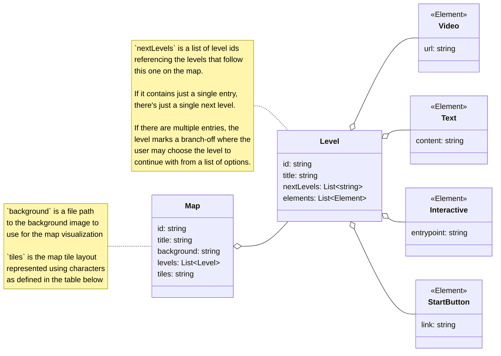

# Architecture – Der kleine Weg des Programmierens



# Maps
* **src/lib/components/Map.svelte**
    * Map rendering component.
    * Props: `structure: MapStructure` (id, title, nodes, tiles).
    * Renders background image
    * Renders tiles following the content of the `tiles` array.
    * Places level nodes at absolute `pos[x,y]`.
    * On node click: navigates to `/map/{mapId}/level/{levelId}`.

* **src/routes/map/[mapId]/+page.svelte**
    * Map view page component.
    * Defines the route for maps.
    * Receives `{ structure }` from loader via `data`.
    * Uses Map component.

* **src/routes/map/[mapId]/+page.ts**
    * Loader for a specific map (`[mapId]` dynamic param).
    * Fetches `/content/{mapId}/structure.json`.
    * Parses/validates with `MapStructure` (Zod); returns `{ structure, mapId }`.
    * Throws on missing/invalid map data to surface errors early.

* **src/lib/schemas.ts**
    * [Zod](https://zod.dev/) validation for map data loaded at runtime.
    * Used in the map page loader to fail-fast on malformed `structure.json`.
    * Could be improved by further error checking (for example invalid tile map).

* **src/lib/types.ts**
    * TypeScript interfaces mirroring schemas for compile-time safety.
    * `MapStructure` and `MapNode` types used by map loader/component.

## Tiles Format
The `tiles` array is an array of strings, where each string defines a line of tiles.
Each character represents a tile.
Each tile has four possible connections (north, east, south, west).

In the following this example map will be used (same as in figma).
```
  ┌───┐ 
─┬┤ ┌─┼─
 ╵└─┤ │ 
    └─┘ 
```

Each tile type is denoted by a single character.
The following table shows the tile types and their connections:

| UTF-8 | Characters   | Description               | North | East | South | West |
|-------|--------------|---------------------------|-------|------|-------|------|
| `╵`   | `'`          | Dead end north            | X     |      |       |      |
| `╶`   | `>`          | Dead end east             |       | X    |       |      |
| `╷`   | `,`          | Dead end south            |       |      | X     |      |
| `╴`   | `<`          | Dead end west             |       |      |       | X    |
| `│`   | `I` `i` `\|` | Vertical line             |       | X    |       | X    |
| `─`   | `-` `–`      | Horizontal line           | X     |      | X     |      |
| `L`   | `L` `l`      | Corner: north & east      | X     | X    |       |      |
| `┌`   | `r` `R`      | Corner: east & south      |       | X    | X     |      |
| `┐`   | `7`          | Corner: west & south      |       |      | X     | X    |
| `┘`   | `J` `j`      | Corner: north & west      | X     |      |       | X    |
| `┬`   | `T` `t`      | T-junction: missing north |       | X    | X     | X    |
| `┤`   | `q` `Q`      | T-junction: missing east  | X     |      | X     | X    |
| `┴`   | `w` `W`      | T-junction: missing south | X     | X    |       | X    |
| `├`   | `p` `P`      | T-junction: missing west  | X     | X    | X     |      |
| `┼`   | `+`          | Cross: all directions     | X     | X    | X     | X    |

In the list format the example map would look like:
```json
"tiles": [
    "  r---7 ",
    "-Tq r-+-",
    " 'L-q I ",
    "    L-J "
]
```

If a tile A is having a connection to a tile B, but B has no connection to A or if B is empty, the connection from A to B is ignored as well.
Example:
```
 I       │ 
-+-  =  ─┴─ 
---     ───
```

The plus in the middle has no connection to the tile to the south. This allows us to define the example map as follows:
```
  +---+
-++ +-+-
 I+-+ I
    +-+
```

# Levels
