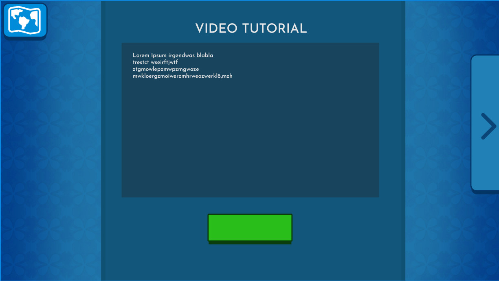
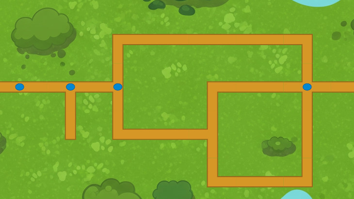

# Der kleine Weg des Programmierens

Der kleine Weg des Programmierens ist eine Open-Source Plattform, um in die Welt der Programmierung einzutauchen.
Zielgruppe sind Kinder und Jugendliche. Es sind keine Vorkenntnisse notwendig.

## Level
Tutorials werden in kurzen Leveln umgesetzt, die ein Thema erklären.

Level bestehen aus unterschiedlichen Elementen. Die folgenden Elemente sind definiert:

- **Markdown**: Ein einfaches Element, um in Markdown formatierten Text zu zeigen
- **Interaktiv**: Bindet [p5.js](https://p5js.org/) Dateien ein, um ein interaktives Tutorial zu ermöglichen.
- **Video**: Zeigt ein Video.
- **Button**: Zeigt einen Knopf, der beispielsweise eine externe Webseite aufrufen kann (z.B. [Scratch](https://scratch.mit.edu)).

## Karten

Mehrere Level sind in Karten organisiert.

